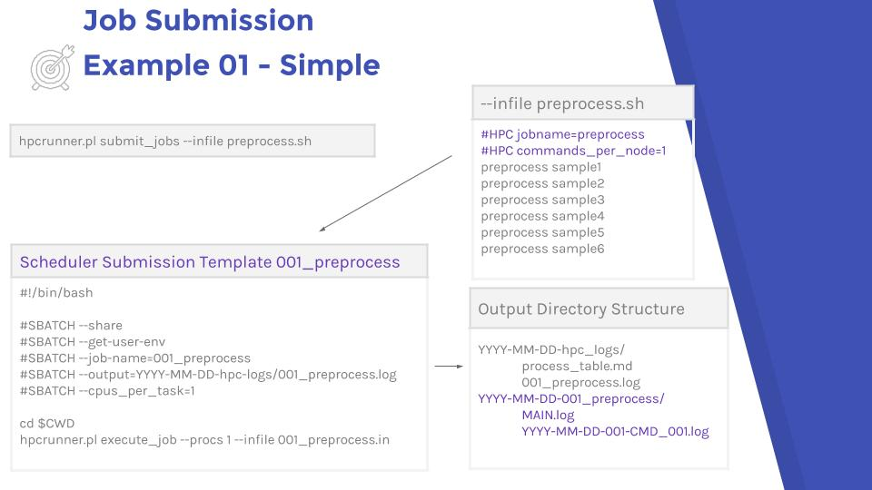
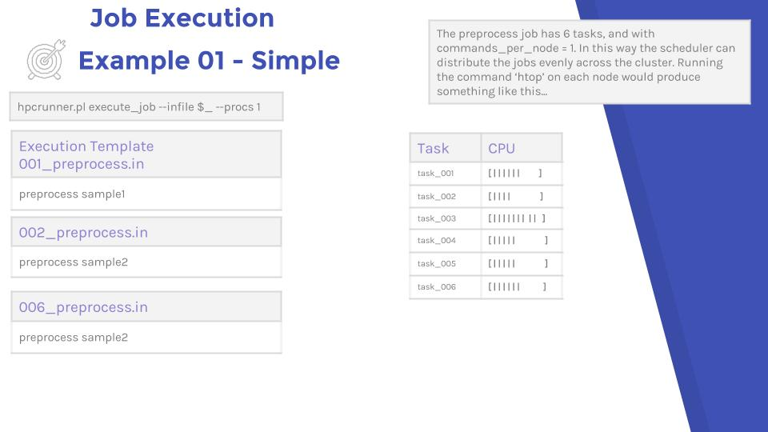

# Example 01 - Simple

The simplest example is one job type, where each task has a single thread. 

```
#Filename - preprocess.sh
#HPC jobname=preprocess
#HPC commands_per_node=1
```

Here is a birds eye view of a simple example.

### Submission and output directory structure




### Job execution



<iframe src="https://jerowe.gitbooks.io/hpc-runner-command-docs/content/examples/example_01_jupyterhub.html"></iframe>
